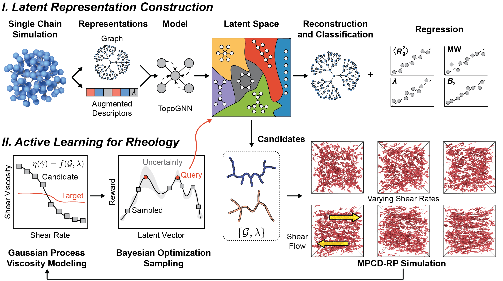

# Data-Driven and Physics-Guided Design of Viscosity-Modifying Polymers

<br />

<br />


## Install Instructions

The `setup.py` file contains all the necessary packages to reproduce the results. The resulting Conda environment takes approximately 8 GB of space. Please ensure that sufficient disk space is available for installation.

```console
$ git clone https://github.com/webbtheosim/cg-topo-solv
$ cd cg-topo-solv
$ conda create --name py310hoomd511 python=3.10.16
$ conda activate py310hoomd511
$ # or source activate py310hoomd511
$ pip install -e .
```