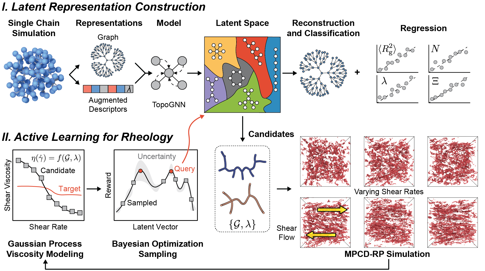

# Data-Driven and Physics-Guided Design of Viscosity-Modifying Polymers

<br />

<br />


## Install Instructions

The `setup.py` file contains all the necessary packages to reproduce the results. 

```console
$ git clone https://github.com/webbtheosim/cg-topo-solv
$ cd cg-topo-solv
$ conda create --name py310hoomd511 python=3.10.16 -y
$ conda activate py310hoomd511
$ # or source activate py310hoomd511
$ pip install -r requirements.txt
$ pip install -e .
```

### Simulation installation

If you want to install the simulation packages and rerun the MPCD simulation with the reverse-perturbation method, you first need HOOMD-blue 5.1.1 and AZPlugins 1.1.0. You can install them by following each project’s build guide。

1. Follow HOOMD-blue’s build instructions for version 5.1.1:  
   https://hoomd-blue.readthedocs.io/en/v5.1.1/building.html

2. Follow AZPlugins’ build instructions for version 1.1.0:  
   https://azplugins.readthedocs.io/en/v1.1.0/index.html

